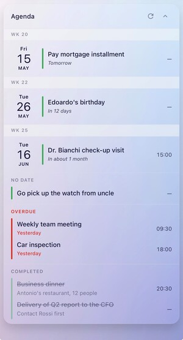
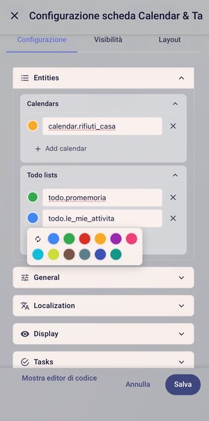
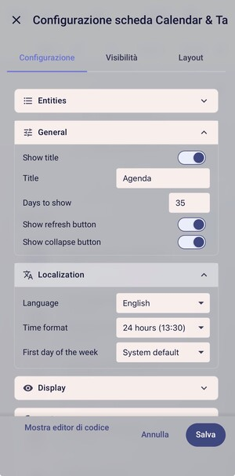
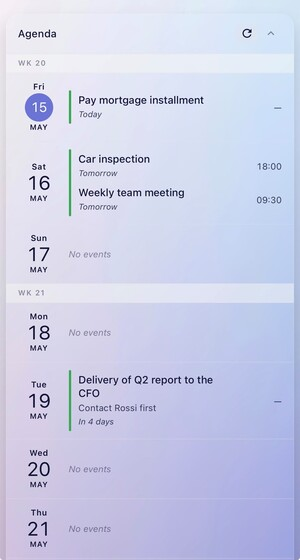
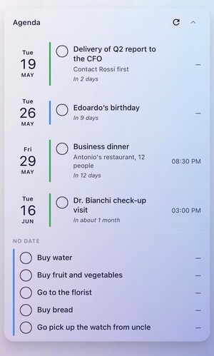

# 🗓 Calendar & Tasks Card

[](https://github.com/hacs/integration)
[](https://github.com/korova-sq/calendar-tasks-card/releases)
[](https://opensource.org/licenses/MIT)


## 🤔 What is Calendar & Tasks Card?

Calendar & Tasks Card is a unified agenda view for [Home Assistant](https://www.home-assistant.io/) that combines **calendar events** and **todo tasks** in a single, clean timeline.

Most agenda cards on HACS show either calendar events OR todo tasks. This card unifies them with smart grouping — designed for dashboards where you want to see "what's coming up" at a glance, mixing appointments and reminders without switching cards.

## ✨ Features

- 🛠 **Visual editor** for all options (no YAML editing required)
- 📅 **Unified view**: events and tasks in one timeline, sorted by date
- 🎨 **Color picker**: 12-color palette per entity, auto-assigned when unset
- ✅ **Task completion**: tick tasks directly from the card
- 🚨 **Overdue section**: tasks past their deadline highlighted in red
- 📋 **No Date section**: active tasks without a due date
- 🗂 **Completed section**: recently finished tasks for context
- ⏱ **Relative time**: "Tomorrow", "In 3 days", "Yesterday", "1 week overdue"
- 📆 **Week numbers**: ISO 8601 week separators (toggle on/off)
- 🔽 **Collapsible**: hide everything with one click, state persists
- 🔄 **Force refresh**: button to update all integrations on demand
- 🌐 **Internationalization**: English and Italian, auto-detects from system
- 🕐 **Time format**: 12h or 24h, follows system preferences
- 👆 **Customizable actions**: tap, hold, double-tap (Home Assistant standard)
- 🪶 **Clean YAML**: only non-default settings are saved
- 🚀 **Zero dependencies**: no other custom cards required

## 📸 Screenshots

### Main view with overdue and completed


### 🎨 Color picker in the editor


### ⚙️ Editor sections


### 📆 Week numbers


### 📋 Clean agenda view


## 📦 Installation

### HACS (recommended)

Calendar & Tasks Card is not yet in the default HACS store. You can add it as a custom repository:

1. Open HACS in Home Assistant
2. Go to **Frontend**
3. Click the three-dot menu (top right) → **Custom repositories**
4. Add: `https://github.com/korova-sq/calendar-tasks-card` (Category: **Lovelace**)
5. Search for **Calendar & Tasks Card** and install
6. Reload your browser (Ctrl+F5 or Cmd+Shift+R)

### Manual installation

1. Download `calendar-tasks-card.js` from the [latest release](https://github.com/korova-sq/calendar-tasks-card/releases)
2. Copy it to `/config/www/calendar-tasks-card.js`
3. Go to **Settings → Dashboards → Resources** (top right ⋮ menu)
4. Click **Add Resource**
5. URL: `/local/calendar-tasks-card.js`, Type: **JavaScript Module**
6. Reload your browser

## ⚙️ Quick start

Once installed, add the card to your dashboard:

1. Edit your dashboard
2. Click **Add Card**
3. Search for **Calendar & Tasks Card**
4. Add your entities and configure via the visual editor

Or via YAML:

```yaml
type: custom:calendar-tasks-card
calendars:
  - calendar.family
todos:
  - todo.shopping
```

That's it. The card will work with sensible defaults.

## 📚 Configuration

The card has a complete visual editor with six sections:

### 📋 Entities
- **Calendars**: any `calendar.*` entity from Home Assistant
- **Todo lists**: any `todo.*` entity (Local To-do, Google Tasks, CalDAV, etc.)

Each entity gets a colored circle where you can pick a color from the 12-color palette. The color applies to the vertical bar next to each event/task in the card.

### 🎛 General
| Option | Default | Description |
|---|---|---|
| `title` | `Agenda` | Card title |
| `show_title` | `true` | Show the title bar |
| `days` | `7` | Days to look ahead |
| `show_refresh` | `true` | Show 🔄 refresh button |
| `show_collapse_button` | `true` | Show ▲ collapse button |

### 🌐 Localization
| Option | Default | Values |
|---|---|---|
| `language` | `auto` | `auto`, `en`, `it` |
| `time_format` | `auto` | `auto`, `24h`, `12h` |
| `first_day_of_week` | `auto` | `auto`, `monday`, `sunday`, `saturday` |

### 👁 Display
| Option | Default | Description |
|---|---|---|
| `show_week_number` | `false` | ISO 8601 week separators |
| `show_end_time` | `false` | Show `HH:MM–HH:MM` for events |
| `show_empty_days` | `false` | Show days with no events |
| `show_relative_time` | `true` | "Tomorrow", "In 3 days" labels |
| `show_source` | `false` | Show entity name as subtitle |
| `show_description` | `true` | Show event/task description |

### ✅ Tasks
| Option | Default | Description |
|---|---|---|
| `show_overdue` | `true` | Show Overdue section |
| `overdue_days` | `0` | Limit overdue (0 = all) |
| `show_completed` | `true` | Show Completed section |
| `completed_days` | `7` | Limit completed to N days |
| `allow_complete` | `false` | Show checkbox to mark complete |

### 👆 Interactions
Three configurable actions following Home Assistant standards:
- **Tap**: single click
- **Hold**: long press
- **Double tap**: two quick clicks

Each can be: `none`, `more-info`, `toggle`, `navigate`, `url`, `call-service`, or `assist`.

## 📝 Complete YAML example

```yaml
type: custom:calendar-tasks-card
title: Agenda
days: 7
calendars:
  - calendar.family
  - calendar.work
todos:
  - todo.shopping
  - todo.work_tasks
show_week_number: true
show_relative_time: true
show_overdue: true
show_completed: true
completed_days: 7
allow_complete: true
language: auto
time_format: 24h
first_day_of_week: monday
entity_colors:
  calendar.family: "#d93025"
  calendar.work: "#4285f4"
  todo.shopping: "#34a853"
tap_action:
  action: navigate
  navigation_path: /lovelace/agenda
```

## 🗂 How tasks are classified

The card automatically sorts tasks into different sections:

| Task state | Where it appears |
|---|---|
| Active, today or future date | In the corresponding day in the agenda |
| Active, no date | 📋 **No Date** section |
| Active, **past date** | 🚨 **Overdue** section (red highlight) |
| Completed (any date) | 🗂 **Completed** section (if enabled) |

## ⚠️ Known limitations

### 🍎 iCloud CalDAV: task completion is broken
Marking a task complete from Home Assistant currently fails for iCloud CalDAV with `Calendar.search() got multiple values for argument 'sort_keys'`. This is a [known bug in Home Assistant core](https://github.com/home-assistant/core/issues), not in this card.

**Workaround**: use Local To-do, Google Tasks, or [Radicale](https://radicale.org/) for tasks you want to complete from HA. iCloud CalDAV still works fine for read-only viewing.

### 📅 Google Tasks: no time-of-day on tasks
The Google Tasks API only stores the date, not the time. Tasks from Google Tasks will show `—` instead of a time, even if you set one in the Google Tasks app. This is a Google limitation.

### ☑ Calendar events can't be "completed"
Calendar events are appointments, not actions — they don't have a completion state. Only tasks (`todo.*` entities) show the completion checkbox.

### 🐌 iCloud propagation delay
Reminders created in the Apple Reminders app on iPhone can take up to 1 hour to appear on Apple's public CalDAV server. Not a card issue. For lower latency, consider a self-hosted CalDAV server like [Radicale](https://radicale.org/) or [Baikal](https://sabre.io/baikal/).

## ⚠️ Disclaimer

This card is provided as-is for convenience. **Do not rely on it as the sole notification system for time-critical events** (medical appointments, flights, important deadlines, etc.). Always set independent notifications in your calendar app or phone for events that matter.

The card depends on third-party integrations (CalDAV, Google Tasks, etc.) which may have their own bugs, latencies, or limitations outside of this card's control. See [Known limitations](#%EF%B8%8F-known-limitations) above.

See the [LICENSE](LICENSE) for full terms — this software is provided without warranty of any kind.

## 🔧 Troubleshooting

**The card doesn't show up after installation**
- Did you reload the browser with Ctrl+F5 (hard refresh)?
- Check Settings → Dashboards → Resources: is the URL correct and the type "JavaScript Module"?
- Open the browser console (F12) and look for errors

**The refresh button gives an error**
- Make sure all calendar and todo entities exist and aren't disabled
- If you've edited the YAML manually, check there are no empty entries (`- ""`)

**Task completion doesn't work**
- Check the limitations section above
- Test the operation manually: Developer Tools → Actions → `todo.update_item`

**Colors don't apply**
- Make sure you clicked "Save" in the editor after picking a color
- Colors are stored in `entity_colors` in the YAML

## 🤝 Contributing

Issues and pull requests are welcome. Please:
- Test changes against multiple integrations (Local To-do, CalDAV, Google Tasks if possible)
- Keep the code style consistent with the rest of the file
- Update the README if you add new options

## 📄 License

[MIT](LICENSE) © 2026 korova-sq
